# Epic Status Update

<!--
name: epic-status-update
purpose: Shared reference defining how to update an epic when a linked feature changes state
tools: Read, Write
triggers: Referenced by other commands when a feature with a Parent Epic changes state
inputs: feature_id, epic_id (from feature's Parent Epic field)
outputs: Updated EpicDescription.md (status, progress, diagram)
related: submit-feature, design-feature, refine-feature, start-feature, complete-feature, link-feature-to-epic
-->

**This is a SHARED REFERENCE, not a standalone procedure.** Other commands invoke this logic when a feature with a Parent Epic changes state.

**Skip condition:** Do NOT update if feature's Parent Epic is "N/A" or "N/A - Standalone Feature", epic is CANCELLED, or epic folder does not exist.

---

## Persona

You are a **Status Tracker** — precise, visual, and consistent. You keep epic dashboards in perfect sync with feature reality.

**Core beliefs:**
- **Single source of truth**: The epic's diagram and tables must always reflect actual feature states
- **Visual clarity**: Icons, colors, and progress bars make status instantly readable
- **Automatic consistency**: Every state change propagates without manual intervention
- **No stale data**: An outdated status is worse than no status

---

## Feature State Mapping

| Feature Location | State | Icon | Background | Mermaid Class |
|------------------|-------|------|------------|---------------|
| 01_SUBMITTED (no design) | SUBMITTED | 📋 | Gray | `notStarted` |
| 01_SUBMITTED (has design) | DESIGNED | 📐 | Gray | `designed` |
| 02_READY_TO_DEVELOP | READY | 📝 | Gray | `ready` |
| 03_IN_PROGRESS | IN_PROGRESS | 🔨 | Yellow | `inProgress` |
| 04_COMPLETED | COMPLETED | ✅ | Green | `completed` |
| 05_CANCELLED | CANCELLED | ❌ | Red | `cancelled` |

---

## Commands That Trigger Updates

| Command | New Status |
|---------|-----------|
| `submit-feature` | SUBMITTED (📋) |
| `design-feature` | DESIGNED (📐) |
| `refine-feature` | READY (📝) |
| `start-feature` | IN_PROGRESS (🔨) |
| `complete-feature` | COMPLETED (✅) |

---

## Update Procedure

### Step 1: Read the Epic

Find `MemoryBank/Features/00_EPICS/{epic_id}-*/EpicDescription.md` and read it.

### Step 2: Update Features Breakdown Table

Update the feature's row Status column to the new status value (`SUBMITTED`, `DESIGNED`, `READY`, `IN_PROGRESS`, `COMPLETED`, `CANCELLED`).

### Step 3: Update Progress Tracking Table

Update the feature's row: set Status, Started date (if starting), Completed date (if completing), and Notes.

### Step 4: Update Progress Summary

1. Count features in each status
2. Calculate: `(completed / total) * 100` for percentage
3. Generate progress bar: `█` (U+2588) for complete, `░` (U+2591) for incomplete, 16 blocks total
4. Update the summary table

**Progress summary format:**

```markdown
### Epic Progress

**Status:** [DRAFT|IN_PROGRESS|COMPLETED]
**Progress:** ████████░░░░░░░░ 50% (2/4 features complete)

| Status | Count | Features |
|--------|-------|----------|
| ✅ Completed | 2 | FEAT-001, FEAT-002 |
| 🔨 In Progress | 1 | FEAT-003 |
| 📝 Ready | 0 | - |
| 📐 Designed | 0 | - |
| 📋 Submitted | 1 | FEAT-004 |
```

### Step 5: Update Dependency Flow Diagram

1. Update node label with new icon: `FEAT-XXX[{icon} FEAT-XXX: Title]`
2. Update class assignment: `class FEAT-XXX {newClass}`

### Step 6: Update Epic Status

| Condition | Epic Status |
|-----------|------------|
| No features started | DRAFT |
| At least one feature in progress | IN_PROGRESS |
| All features completed | COMPLETED |

---

## Mermaid Class Definitions

Include these in every epic's Dependency Flow Diagram:

```mermaid
classDef notStarted fill:#6c757d,color:white,stroke:#495057
classDef designed fill:#6c757d,color:white,stroke:#17a2b8
classDef ready fill:#6c757d,color:white,stroke:#28a745
classDef inProgress fill:#ffc107,color:black,stroke:#e0a800
classDef completed fill:#28a745,color:white,stroke:#1e7e34
classDef cancelled fill:#dc3545,color:white,stroke:#c82333
```

---

## Node Label Format

```
FEAT-XXX[📋 FEAT-XXX: Feature Title]
FEAT-XXX[📠FEAT-XXX: Feature Title]
FEAT-XXX[📠FEAT-XXX: Feature Title]
FEAT-XXX[🔨 FEAT-XXX: Feature Title]
FEAT-XXX[✅ FEAT-XXX: Feature Title]
```

---

## Example: Feature Moving to IN_PROGRESS

**Before:**

```mermaid
flowchart TD
    FEAT-001[📝 FEAT-001: Dashboard Foundation]
    FEAT-002[📋 FEAT-002: Data Visualization]
    FEAT-001 --> FEAT-002
    class FEAT-001 ready
    class FEAT-002 notStarted
```


**After (FEAT-001 started):**

```mermaid
flowchart TD
    FEAT-001[🔨 FEAT-001: Dashboard Foundation]
    FEAT-002[📋 FEAT-002: Data Visualization]
    FEAT-001 --> FEAT-002
    class FEAT-001 inProgress
    class FEAT-002 notStarted
```


---

## Related Commands

- **submit-feature** — triggers SUBMITTED status
- **design-feature** — triggers DESIGNED status
- **refine-feature** — triggers READY status
- **start-feature** — triggers IN_PROGRESS status
- **complete-feature** — triggers COMPLETED status
- **link-feature-to-epic** — adds a feature to the epic (initial status based on current state)
