# Epic Status Update - Shared Reference

This document defines how to update an epic's visual status when a linked feature changes state.

**IMPORTANT:** Only apply these updates if the feature has a Parent Epic (epic_id is not "N/A").

---

## Feature State Mapping

| Feature Location | State Name | Background | Icon | Mermaid Class |
|------------------|------------|------------|------|---------------|
| 01_SUBMITTED (no design) | SUBMITTED | Gray | 📋 | `notStarted` |
| 01_SUBMITTED (has design) | DESIGNED | Gray | 📐 | `designed` |
| 02_READY_TO_DEVELOP | READY | Gray | 📝 | `ready` |
| 03_IN_PROGRESS | IN_PROGRESS | Yellow | 🔨 | `inProgress` |
| 04_COMPLETED | COMPLETED | Green | ✅ | `completed` |
| 05_CANCELLED | CANCELLED | Red | ❌ | `cancelled` |

---

## Mermaid Class Definitions

Add these class definitions to the epic's Dependency Flow Diagram:

```mermaid
%% Status classes - Background colors
classDef notStarted fill:#6c757d,color:white,stroke:#495057
classDef designed fill:#6c757d,color:white,stroke:#17a2b8
classDef ready fill:#6c757d,color:white,stroke:#28a745
classDef inProgress fill:#ffc107,color:black,stroke:#e0a800
classDef completed fill:#28a745,color:white,stroke:#1e7e34
classDef cancelled fill:#dc3545,color:white,stroke:#c82333
```

---

## Node Label Format

Feature nodes should include the emoji icon:

```
FEAT-XXX[📋 FEAT-XXX: Feature Title]
FEAT-XXX[📠FEAT-XXX: Feature Title]
FEAT-XXX[📠FEAT-XXX: Feature Title]
FEAT-XXX[🔨 FEAT-XXX: Feature Title]
FEAT-XXX[✅ FEAT-XXX: Feature Title]
```

---

## Progress Summary Format

Add this above the Mermaid diagram in the epic:

```markdown
### Epic Progress

**Status:** IN_PROGRESS
**Progress:** ████████░░░░░░░░ 50% (2/4 features complete)

| Status | Count | Features |
|--------|-------|----------|
| ✅ Completed | 2 | FEAT-001, FEAT-002 |
| 🔨 In Progress | 1 | FEAT-003 |
| 📝 Ready | 0 | - |
| 📐 Designed | 0 | - |
| 📋 Submitted | 1 | FEAT-004 |
```

Progress bar characters:
- Full block: █ (U+2588)
- Empty block: ░ (U+2591)
- Calculate: (completed / total) * 16 blocks

---

## Update Procedure

When a feature's state changes, update the parent epic as follows:

### Step 1: Read the Epic

1. Find the epic folder: `MemoryBank/Features/00_EPICS/{epic_id}-*/`
2. Read `EpicDescription.md`

### Step 2: Update Features Breakdown Table

Find the feature's row and update the Status column:

| Feature ID | Title | Status | Dependencies | Priority |
|------------|-------|--------|--------------|----------|
| FEAT-XXX | Title | **[NEW_STATUS]** | ... | ... |

Status values: `SUBMITTED`, `DESIGNED`, `READY`, `IN_PROGRESS`, `COMPLETED`, `CANCELLED`

### Step 3: Update Progress Tracking Table

Find the feature's row and update:

| Feature ID | Status | Started | Completed | Notes |
|------------|--------|---------|-----------|-------|
| FEAT-XXX | **[NEW_STATUS]** | **[date if starting]** | **[date if completing]** | **[update notes]** |

### Step 4: Update Progress Summary

1. Count features in each status
2. Calculate completion percentage: `(completed / total) * 100`
3. Generate progress bar: `█` for complete portions, `░` for incomplete
4. Update the summary table

### Step 5: Update Dependency Flow Diagram

1. Find the feature's node in the Mermaid diagram
2. Update the node label with new icon:
   ```
   FEAT-XXX[{icon} FEAT-XXX: Title]
   ```
3. Update the class assignment:
   ```
   class FEAT-XXX {newClass}
   ```

### Step 6: Update Epic Status (if needed)

Epic status should reflect overall progress:
- `DRAFT` - No features started
- `IN_PROGRESS` - At least one feature in progress
- `COMPLETED` - All features completed

---

## Example: Feature Moving to IN_PROGRESS

**Before:**

```mermaid
flowchart TD
    FEAT-001[📝 FEAT-001: Dashboard Foundation]
    FEAT-002[📋 FEAT-002: Data Visualization]

    FEAT-001 --> FEAT-002

    class FEAT-001 ready
    class FEAT-002 notStarted
```


**After (FEAT-001 started):**

```mermaid
flowchart TD
    FEAT-001[🔨 FEAT-001: Dashboard Foundation]
    FEAT-002[📋 FEAT-002: Data Visualization]

    FEAT-001 --> FEAT-002

    class FEAT-001 inProgress
    class FEAT-002 notStarted
```


---

## Commands That Trigger Updates

| Command | State Change | New Status |
|---------|--------------|------------|
| `submit-feature` | Create | SUBMITTED (📋) |
| `design-feature` | Design complete | DESIGNED (📐) |
| `refine-feature` | Move to 02_READY | READY (📝) |
| `start-feature` | Move to 03_IN_PROGRESS | IN_PROGRESS (🔨) |
| `complete-feature` | Move to 04_COMPLETED | COMPLETED (✅) |

---

## Skip Conditions

**Do NOT update epic if:**
- Feature has no Parent Epic (`Parent Epic` = "N/A" or "N/A - Standalone Feature")
- Epic is in CANCELLED status
- Epic folder does not exist
