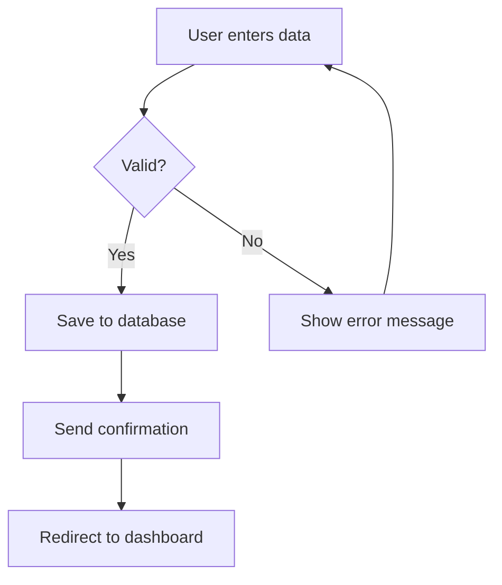

# Refine Feature - MCP Procedure

You are executing the **Refine Feature** procedure for the DevCycleManager. This procedure transforms a feature from the `01_SUBMITTED` state into a detailed, implementable task breakdown ready for development.

## Input Provided
- **Feature ID**: {{feature_id}}
- **Feature Path** (if provided): {{feature_path}}

---

## Purpose

This procedure is the **bridge between requirements and implementation**. It:
1. Analyzes ALL feature documents (description, UX research, wireframes, design summary)
2. Studies the existing codebase for patterns and conventions
3. Creates a phased implementation plan with proper dependency ordering
4. Breaks down each phase into independent, testable tasks
5. Adds unit test tasks for every implementation task
6. Includes checkpoints to ensure quality gates

---

## Core Principles

### 1. Phase Precedence
Phases MUST be ordered by dependency:
- **Data layer first** (models, DTOs, contracts)
- **Business logic second** (services, state management)
- **UI last** (views, components)

You cannot start a phase that depends on work from an incomplete phase.

### 2. Task Independence
Within a phase, tasks should be:
- **Independent** - Can be completed without waiting for other tasks in the same phase
- **Testable** - Each task produces testable output
- **Small** - Can be completed in a single session

### 3. Test-First Mindset
- Every implementation task MUST have a corresponding unit test task
- Tests are written/defined alongside implementation
- No phase completes without tests passing

### 4. Boy Scout Rule
> "Always leave the code better than you found it"

If the build has warnings or tests are failing (even unrelated ones), they MUST be fixed before proceeding.

### 5. Technology-Agnostic Documentation (CRITICAL)

**Phase and Task documents MUST be readable by both business analysts and developers.**

#### NO CODE in Phase/Task Files
- ❌ **NEVER** include code snippets (C#, JavaScript, Python, etc.)
- ❌ **NEVER** include class definitions, method signatures, or interfaces
- ❌ **NEVER** use technology-specific terminology without explanation

#### Use These Formats Instead:

**For Behavior/Logic → Gherkin (Given/When/Then):**
```gherkin
Scenario: User submits valid form
  Given the user has filled all required fields
  And the email format is valid
  When the user clicks the Submit button
  Then the system saves the data
  And displays a success confirmation
  And redirects to the dashboard
```

**For Complex Flows → Mermaid Flowcharts:**


**For Data Structures → Plain descriptions or JSON schemas:**
```
User Profile:
- Name (required, 2-100 characters)
- Email (required, valid email format)
- Phone (optional, international format)
- Role (one of: Admin, Editor, Viewer)
```

**For Necessary Code → Create Auxiliary Files:**
If code examples are truly necessary:
1. Create a file: `Phases/code-samples/phase-N-task-M-sample.md`
2. Reference it in the task: "See implementation example: [code-samples/phase-N-task-M-sample.md]"
3. The main task description remains code-free

#### Why This Matters
- **Business analysts** can review and validate requirements
- **Developers** understand WHAT to build, not HOW (they decide the HOW)
- **QA engineers** can create test cases from Gherkin scenarios
- **Documentation** remains valid even if technology changes

---

## Step 0: Locate and Analyze the Feature

### Find the Feature
Search for the feature folder in `MemoryBank/Features/`:
1. First check `01_SUBMITTED/` for `{{feature_id}}*` folders
2. If not found, check `02_READY_TO_DEVELOP/`

**If the feature is not found:** Stop and report: "Feature {{feature_id}} not found."

### Read ALL Feature Documents
Read every file in the feature folder:
1. **FeatureDescription.md** - Primary requirements
2. **UX-research-report.md** - User needs and workflows (if exists)
3. **Wireframes-design.md** - Visual specifications (if exists)
4. **design-summary.md** - Consolidated design (if exists)

### Read Project Context
1. **MemoryBank/Overview/** - Project vision, architecture
2. **MemoryBank/Architecture/** - System design, components
3. **MemoryBank/CodeGuidelines/** - Standards, patterns, conventions

### Extract Project Technology Stack (CRITICAL)

Before creating tasks, you MUST understand the project's technology stack. **ASK THE USER** if the information is not documented:

#### Technology Detection Checklist

Search the project for technology indicators:
- `package.json` → Node.js/JavaScript/TypeScript project
- `next.config.js` or `next.config.mjs` → Next.js project
- `tsconfig.json` → TypeScript configuration
- `.eslintrc.*` or `eslint.config.*` → ESLint configuration
- `.prettierrc.*` → Prettier configuration
- `*.csproj` or `*.sln` → .NET project
- `pom.xml` → Java/Maven project
- `requirements.txt` or `pyproject.toml` → Python project
- `Cargo.toml` → Rust project
- `go.mod` → Go project

**You MUST document:**

| Technology | Detected? | Details |
|------------|-----------|---------|
| **Framework** | Yes/No | e.g., Next.js 14, .NET 8, Django 5 |
| **Language** | Yes/No | e.g., TypeScript 5.x, C# 12, Python 3.11 |
| **Lint Tool** | Yes/No | e.g., ESLint, Pylint, dotnet format |
| **Formatter** | Yes/No | e.g., Prettier, Black, dotnet format |
| **Test Framework** | Yes/No | e.g., Jest, xUnit, pytest |
| **Package Manager** | Yes/No | e.g., npm, pnpm, yarn, NuGet |

#### If Technology Stack is UNCLEAR

**ASK THE USER** with this format:

```
🔍 Technology Stack Detection

I need to understand your project's technology stack to create accurate phase checkpoints.

Please confirm or provide:

1. **Framework**: [Detected: X] Is this correct? What version?
2. **Lint Tool**: Do you use a linter? (e.g., ESLint, Pylint)
   - If ESLint: What is the lint command? (e.g., `npm run lint`, `npx eslint .`)
   - Should lint errors block phase completion? [Yes/No]
3. **Formatter**: Do you use a code formatter? (e.g., Prettier, Black)
4. **Test Framework**: [Detected: X] Is this correct?
```

### Extract Project Build & Test Commands (CRITICAL)

Search the project documentation for **how to build and test** this specific project. Look in:
- `MemoryBank/CodeGuidelines/` - Build instructions, test commands
- `MemoryBank/Overview/` - Development setup, tooling
- `README.md` or `CLAUDE.md` in project root - Quick start commands

**You MUST find and document:**

| Information | Where Found | Command/Value |
|-------------|-------------|---------------|
| **Build Command** | [File path] | e.g., `npm run build`, `dotnet build`, `mvn package` |
| **Build Success Criteria** | [File path] | e.g., "0 errors, 0 warnings" |
| **Unit Test Command** | [File path] | e.g., `npm test`, `dotnet test`, `pytest` |
| **Test Success Criteria** | [File path] | e.g., "All tests passing" |
| **Lint Command** | [File path] | e.g., `npm run lint`, `eslint .`, `dotnet format --verify-no-changes` |
| **Lint Success Criteria** | [File path] | e.g., "0 errors, 0 warnings" |
| **Integration Test Command** | [File path] | (if applicable) |

**If ANY of this information is MISSING from project documentation:**
1. Mark as `⚠️ NOT DOCUMENTED`
2. **ASK THE USER** for the missing commands
3. Add to the "Missing Project Configuration" section in FeatureTasks.md
4. Use generic placeholders in checkpoints: `[PROJECT_BUILD_COMMAND]`, `[PROJECT_TEST_COMMAND]`, `[PROJECT_LINT_COMMAND]`
5. The user MUST provide these commands before Phase 0 can complete

### Identify Feature Type
Determine if this feature is:
- **Full-stack** (UI + Backend)
- **Frontend-only** (UI changes only)
- **Backend-only** (API/Service changes only)

This affects the phases needed.

---

## Step 1: Study the Codebase

Before creating tasks, you MUST understand existing patterns:

### Search for Similar Components
- Find files similar to what this feature will create
- Note file locations, naming conventions, patterns used
- Identify code to reuse vs. code to create new

### Document Patterns to Follow
```markdown
### Codebase Patterns Identified
| Pattern | Example File | Notes |
|---------|--------------|-------|
| [Pattern name] | [File path] | [How to apply] |
```

### Note Patterns to AVOID
Document anti-patterns or legacy code that should not be followed.

---

## Step 2: Define Implementation Phases

Based on feature type and dependencies, define phases.

### Standard Phase Structure (Full-Stack Feature)

| Phase | Name | Purpose | Depends On |
|-------|------|---------|------------|
| 0 | Health Check | Verify build/tests before starting | - |
| 1 | Planning & Analysis | Finalize technical approach | Phase 0 |
| 2 | Data Layer | Models, DTOs, schemas, contracts, database entities | Phase 1 |
| 3 | Business Logic | Services, state management, domain rules, APIs | Phase 2 |
| 4 | Presentation Logic | Controllers, presenters, view-models, handlers | Phase 3 |
| 5 | User Interface | Views, components, templates, screens | Phase 4 |
| 6 | Integration | Wire everything together, routing, DI | Phase 5 |
| 7 | Testing & Polish | End-to-end tests, refinements | Phase 6 |
| 8 | Final Checkpoint | Complete verification | Phase 7 |

**Technology Examples:**
- **Node.js/Express**: Models → Services → Controllers → Templates/React
- **WinUI3/MVVM**: DTOs → StateManager → ViewModels → XAML Views
- **React/Redux**: Types → Reducers/Actions → Containers → Components
- **Django**: Models → Services → Views → Templates
- **Spring Boot**: Entities → Services → Controllers → Thymeleaf/React

### Frontend-Only Feature
Skip phases 2-3 (Data Layer, Business Logic) if backend already exists.

### Backend-Only Feature
Skip phases 4-5 (Presentation Logic, User Interface) if no UI.

---

## Step 3: Create Phase Files

Create a `Phases/` folder in the feature directory and generate individual phase files.

### Phase File Template

```markdown
# Phase [N]: [Phase Name]

**Status**: ⏸️ PENDING
**Depends On**: Phase [N-1] (if applicable)
**Estimated Time (Man/Hour)**: [X]h
**Estimated Time (AI/Hour)**: [Y]h
**Actual Time (Man/Hour)**: -
**Actual Time (AI/Hour)**: -

---

## Objectives
- [Clear goal 1]
- [Clear goal 2]
- [Clear goal 3]

---

## Pre-Phase Checklist
- [ ] Previous phase completed (if applicable)
- [ ] Build passing: `[PROJECT_BUILD_COMMAND]` → 0 errors, 0 warnings
- [ ] Tests passing: `[PROJECT_TEST_COMMAND]` → 100% green
- [ ] No unresolved blockers

---

## Tasks

### Task [N.1]: [Task Name]

**Status**: ⏸️ PENDING
**Estimated (Man/Hour)**: [X]h | **Estimated (AI/Hour)**: [Y]h
**Actual (Man/Hour)**: - | **Actual (AI/Hour)**: -

**Objective:**
[What this task accomplishes - in plain language]

**User Story:**
As a [type of user], I want [goal] so that [benefit].

**Behavior Specification (Gherkin):**
```gherkin
Scenario: [Main success scenario]
  Given [initial context/state]
  And [additional preconditions if any]
  When [action/trigger]
  Then [expected outcome]
  And [additional outcomes if any]

Scenario: [Alternative/Error scenario]
  Given [initial context/state]
  When [action that causes alternative path]
  Then [expected alternative outcome]
```

**Data Requirements:**
[Describe data structures in plain language, NOT code]
- Input: [What data is needed, validation rules]
- Output: [What data is produced]
- Storage: [Where data is persisted, if applicable]

**Business Rules:**
- [Rule 1 in plain language]
- [Rule 2 in plain language]

**Acceptance Criteria:**
- [ ] [Criterion 1 - testable, measurable]
- [ ] [Criterion 2 - testable, measurable]
- [ ] [Criterion 3 - testable, measurable]

**References:**
- Similar behavior: `[file path or feature]` - for [aspect]
- Design document: `[link to UX/wireframe if applicable]`

**Deliverables:**
- [ ] Implementation complete
- [ ] Build passing (0 errors, 0 warnings)
- [ ] Unit tests written and passing

**Git Commits:**
| Commit Hash | Message | Date |
|-------------|---------|------|
| - | - | - |

> 📝 **Instructions**: After each commit related to this task, add a row with the short hash (7 chars), commit message, and date. This enables traceability from commit → task → phase → feature.

---

### Task [N.2]: Unit Tests for Task [N.1]

**Status**: ⏸️ PENDING
**Estimated (Man/Hour)**: [X]h | **Estimated (AI/Hour)**: [Y]h
**Actual (Man/Hour)**: - | **Actual (AI/Hour)**: -

**Objective:**
Verify all behaviors defined in Task [N.1] work correctly.

**Test Scenarios (Gherkin):**
```gherkin
Scenario: [Happy path - main success]
  Given [setup]
  When [action]
  Then [expected result]

Scenario: [Edge case - boundary condition]
  Given [setup with edge values]
  When [action]
  Then [expected result]

Scenario: [Error case - invalid input]
  Given [setup with invalid data]
  When [action]
  Then [appropriate error handling]
```

**Coverage Requirements:**
- All scenarios from Task [N.1] behavior specification
- Edge cases and boundary conditions
- Error handling paths

**Deliverables:**
- [ ] All test scenarios implemented
- [ ] All tests passing
- [ ] Coverage documented

**Git Commits:**
| Commit Hash | Message | Date |
|-------------|---------|------|
| - | - | - |

---

[Continue with more tasks as needed...]

---

## Phase Checkpoint: [Phase Name] Complete

**Status**: ⏸️ NOT STARTED
**Checkpoint Date**: -

### Build Verification
**Command**: `[PROJECT_BUILD_COMMAND]`
**Expected**: [PROJECT_BUILD_SUCCESS_CRITERIA]

- [ ] Build command executed successfully
- [ ] 0 errors
- [ ] 0 warnings (or documented exceptions with justification)

**Build Output** (paste actual output):
```
[Paste build output here when checkpoint is completed]
```

### Lint Verification (if applicable)
**Command**: `[PROJECT_LINT_COMMAND]`
**Expected**: [PROJECT_LINT_SUCCESS_CRITERIA]

- [ ] Lint command executed successfully
- [ ] 0 errors
- [ ] 0 warnings (or documented exceptions with justification)

**Lint Output** (paste actual output):
```
[Paste lint output here when checkpoint is completed]
```

> ⚠️ **BLOCKING**: If lint errors or warnings are found, they MUST be fixed before proceeding. Do NOT skip this step.

### Test Verification
**Command**: `[PROJECT_TEST_COMMAND]`
**Expected**: [PROJECT_TEST_SUCCESS_CRITERIA]

- [ ] Test command executed successfully
- [ ] All unit tests passing
- [ ] All integration tests passing (if applicable)
- [ ] No skipped tests without documented reason

**Test Output** (paste actual output):
```
[Paste test output here when checkpoint is completed]
```

### Git Commits (Phase Summary)

> 📝 **Instructions**: This is a consolidated list of ALL commits made during this phase. Each task should also track its own commits. This summary enables quick traceability from phase to commits.

| # | Commit Hash | Message | Task | Date |
|---|-------------|---------|------|------|
| 1 | - | - | - | - |

**Total Commits in Phase**: 0

---

### Code Review (for code-relevant phases)

> 🔴 **IMPORTANT**: For phases with code implementation (NOT just DTOs, config, or planning), you MUST invoke the `code-review` MCP command.

**Phases requiring code review:**
- Phase 2 (Data Layer) - If contains business logic, not just DTOs
- Phase 3 (Business Logic) - **ALWAYS**
- Phase 4 (Presentation Logic) - **ALWAYS**
- Phase 5 (User Interface) - **ALWAYS**
- Phase 6 (Integration) - If contains significant code
- Phase 7 (Testing & Polish) - If contains new code beyond tests

**Phases that may SKIP code review:**
- Phase 0 (Health Check) - No code changes
- Phase 1 (Planning & Analysis) - No code changes
- Phase 8 (Final Checkpoint) - Verification only
- Any phase with ONLY: DTOs, config files, documentation

**To invoke code review:**
```
MCP Command: code-review
Parameters:
  - feature_id: {{feature_id}}
  - phase_number: [current_phase_number]
```

#### Code Review History

> 📝 **Instructions**: After each code review, add a new row. If issues are found (`NEEDS_CHANGES` or `APPROVED_WITH_NOTES`), fix the issues and run another code review. The phase can only be completed when the **latest** review is `APPROVED` or `APPROVED_WITH_NOTES` (with all notes addressed).

| # | Date | Status | Report | Notes |
|---|------|--------|--------|-------|
| 1 | - | ⏸️ NOT STARTED | - | - |

**Current Code Review Status**: ⏸️ NOT STARTED
**Latest Review Result**: -
**Reviews Required to Pass**: -

> ⚠️ **BLOCKING**: If the latest code review is `NEEDS_CHANGES`, you MUST:
> 1. Fix all identified issues
> 2. Run the `code-review` MCP command again
> 3. Repeat until status is `APPROVED` or `APPROVED_WITH_NOTES`

---

### Boy Scout Rule Compliance
- [ ] No pre-existing warnings introduced
- [ ] No pre-existing test failures introduced
- [ ] Any found issues have been fixed

### Time Tracking
| Task | Estimated (Man) | Actual (Man) | Estimated (AI) | Actual (AI) |
|------|-----------------|--------------|----------------|-------------|
| [Task 1] | [X]h | - | [Y]h | - |
| [Task 2] | [X]h | - | [Y]h | - |
| **Total** | **[X]h** | **-** | **[Y]h** | **-** |

### Checkpoint Sign-off
- [ ] All tasks completed
- [ ] Build is clean (0 errors, 0 warnings)
- [ ] Lint is clean (0 errors, 0 warnings) - if applicable
- [ ] All tests passing
- [ ] Code review completed (APPROVED or APPROVED_WITH_NOTES) - if applicable
- [ ] Ready for next phase

---

## Notes & Decisions
- [Document any deviations from plan]
- [Record technical decisions made]

## Next Phase
- **Phase [N+1]**: [Name]
- **Prerequisites from this phase**: [What must be ready]
```

---

## Step 4: Create FeatureTasks.md Summary

Create `FeatureTasks.md` in the feature folder with this structure:

```markdown
# Feature Tasks: {{feature_id}} - [Feature Name]

**Feature ID**: {{feature_id}}
**Status**: READY_TO_DEVELOP
**Created**: [Date]
**Last Updated**: [Date]

---

## Overview
[Brief description of what this feature accomplishes]

---

## Project Technology Stack

**Detected/Confirmed**: [Date]

| Technology | Value | Source |
|------------|-------|--------|
| **Framework** | [e.g., Next.js 14, .NET 8, Django 5] | [File/User] |
| **Language** | [e.g., TypeScript 5.x, C# 12, Python 3.11] | [File/User] |
| **Lint Tool** | [e.g., ESLint, Pylint, dotnet format, or "None"] | [File/User] |
| **Formatter** | [e.g., Prettier, Black, or "None"] | [File/User] |
| **Test Framework** | [e.g., Jest, xUnit, pytest] | [File/User] |
| **Package Manager** | [e.g., npm, pnpm, yarn, NuGet] | [File/User] |

---

## Project Build & Test Configuration

**Source**: [Document where this information was found, or "⚠️ NOT DOCUMENTED"]

| Action | Command | Success Criteria | Blocking? |
|--------|---------|------------------|-----------|
| **Build** | `[PROJECT_BUILD_COMMAND]` | [PROJECT_BUILD_SUCCESS_CRITERIA] | ✅ Yes |
| **Unit Tests** | `[PROJECT_TEST_COMMAND]` | [PROJECT_TEST_SUCCESS_CRITERIA] | ✅ Yes |
| **Lint** | `[PROJECT_LINT_COMMAND]` | 0 errors, 0 warnings | ✅ Yes |
| **Format Check** | `[PROJECT_FORMAT_COMMAND]` | No changes needed | ⚠️ Optional |
| **Integration Tests** | `[PROJECT_INTEGRATION_TEST_COMMAND]` | [If applicable, or "N/A"] | ⚠️ Optional |

### Lint Configuration

**Lint Enabled**: [Yes/No]
**Lint Command**: `[e.g., npm run lint, eslint ., dotnet format --verify-no-changes]`
**Lint Blocks Checkpoint**: [Yes/No] - If Yes, lint errors MUST be fixed before phase completion

> 🔴 **IMPORTANT**: If lint is enabled and blocking, every phase checkpoint MUST run the lint command and fix any errors/warnings before proceeding.

### Missing Project Configuration ⚠️

[If any commands are missing from project documentation, list them here:]

- [ ] **Build Command**: Not documented - user must provide before Phase 0
- [ ] **Test Command**: Not documented - user must provide before Phase 0
- [ ] **Lint Command**: Not documented - user must confirm if lint is used
- [ ] **Success Criteria**: Not documented - using defaults (0 errors, 0 warnings, all tests pass)

**Action Required**: Before starting Phase 0, ensure all build, test, and lint commands are documented in `MemoryBank/CodeGuidelines/` or update this section with the correct commands.

---

## Phase Summary

| Phase | Name | Est. Man/Hour | Est. AI/Hour | Status | Actual Man | Actual AI | Details |
|-------|------|---------------|--------------|--------|------------|-----------|---------|
| 0 | Health Check | 0.5h | 0h | ⏸️ PENDING | - | - | [Link](Phases/phase-0-health-check.md) |
| 1 | Planning & Analysis | 2h | 1h | ⏸️ PENDING | - | - | [Link](Phases/phase-1-planning-analysis.md) |
| 2 | Data Layer | 3h | 1h | ⏸️ PENDING | - | - | [Link](Phases/phase-2-data-layer.md) |
| 3 | Business Logic | 4h | 2h | ⏸️ PENDING | - | - | [Link](Phases/phase-3-business-logic.md) |
| 4 | Presentation Logic | 3h | 1.5h | ⏸️ PENDING | - | - | [Link](Phases/phase-4-presentation-logic.md) |
| 5 | User Interface | 4h | 2h | ⏸️ PENDING | - | - | [Link](Phases/phase-5-user-interface.md) |
| 6 | Integration | 2h | 1h | ⏸️ PENDING | - | - | [Link](Phases/phase-6-integration.md) |
| 7 | Testing & Polish | 3h | 1.5h | ⏸️ PENDING | - | - | [Link](Phases/phase-7-testing-polish.md) |
| 8 | Final Checkpoint | 1h | 0.5h | ⏸️ PENDING | - | - | [Link](Phases/phase-8-final-checkpoint.md) |

**Total Estimated**: [X]h (Man) + [Y]h (AI) = **[Total]h**
**Total Actual**: 0h (Man) + 0h (AI) = **0h**

---

## Progress Tracking

**Current Phase**: Phase 0 - Health Check
**Completed Phases**: 0/9
**Completion**: 0%

---

## Status Legend

- ⏸️ **PENDING**: Not started
- 🔄 **IN_PROGRESS**: Currently active
- ✅ **COMPLETED**: Done and verified
- ❌ **BLOCKED**: Waiting on dependency or issue

---

## Key Files to Create/Modify

| File | Action | Phase |
|------|--------|-------|
| [File 1] | Create | Phase 2 |
| [File 2] | Create | Phase 3 |
| [File 3] | Modify | Phase 4 |

---

## Quality Gates

Every phase checkpoint requires (using project-specific commands from above):

1. ✅ **Build**: `[PROJECT_BUILD_COMMAND]` → 0 errors, 0 warnings
2. ✅ **Lint** (if enabled): `[PROJECT_LINT_COMMAND]` → 0 errors, 0 warnings
3. ✅ **Tests**: `[PROJECT_TEST_COMMAND]` → 100% green
4. ✅ **Code Review** (for code-relevant phases): `code-review` MCP command → APPROVED or APPROVED_WITH_NOTES
5. ✅ **Boy Scout Rule**: No new issues introduced, pre-existing issues fixed
6. ✅ **Time tracking**: Actual times recorded

**Proof Required**: Each checkpoint must include the actual command output as evidence.

### Code Review Requirements

For phases with code implementation, invoke the `code-review` MCP command:

```
MCP Command: code-review
Parameters:
  - feature_id: [feature_id]
  - phase_number: [phase_number]
```

**Code review is REQUIRED for:**
- Phase 3 (Business Logic) - **ALWAYS**
- Phase 4 (Presentation Logic) - **ALWAYS**
- Phase 5 (User Interface) - **ALWAYS**
- Any phase with significant code changes

**Code review may be SKIPPED for:**
- Phase 0, 1, 8 (no code changes)
- Phases with ONLY DTOs, config files, or documentation

The code review uses the project's `CodeGuidelines` to validate code quality.

---

## Notes

- [Important note 1]
- [Important note 2]
```

---

## Step 5: Move Feature to 02_READY_TO_DEVELOP

After creating all phase files and FeatureTasks.md:

1. **Move the entire feature folder** from `01_SUBMITTED/` to `02_READY_TO_DEVELOP/`
2. **Update FeatureDescription.md** to reflect the new state

Add this section to FeatureDescription.md:

```markdown
## Feature State Tracking

**Current State**: 02_READY_TO_DEVELOP
**Last State Change**: [Date]
**Phase Progress**: 0/9 phases completed

### State History
| Date | From State | To State | Action |
|------|------------|----------|--------|
| [Submitted Date] | - | 01_SUBMITTED | Initial submission |
| [Today's Date] | 01_SUBMITTED | 02_READY_TO_DEVELOP | Refinement complete |
```

---

## Step 6: Confirm Completion

After all steps are complete, provide this summary:

```
✅ Feature Refinement Complete for {{feature_id}}

📁 Feature Location: MemoryBank/Features/02_READY_TO_DEVELOP/[feature-folder]/

📄 Documents Created:
   • FeatureTasks.md - Task summary with phase links
   • Phases/phase-0-health-check.md
   • Phases/phase-1-planning-analysis.md
   • Phases/phase-2-data-layer.md
   • Phases/phase-3-business-logic.md
   • Phases/phase-4-presentation-logic.md
   • Phases/phase-5-user-interface.md
   • Phases/phase-6-integration.md
   • Phases/phase-7-testing-polish.md
   • Phases/phase-8-final-checkpoint.md

📊 Time Estimates:
   • Total Man/Hour: [X]h
   • Total AI/Hour: [Y]h
   • Total Combined: [Z]h

📋 Next Steps:
   1. Review the phase breakdown
   2. Start with Phase 0 (Health Check)
   3. Complete each phase before moving to the next
   4. Update actual times as work progresses
```

---

## Error Handling

- **Feature not found**: Report clearly and list available features in 01_SUBMITTED
- **FeatureDescription.md missing**: Cannot proceed - stop and report
- **Unable to create Phases folder**: Report error and which step failed
- **Unable to move feature**: Report error but note refinement is complete
- **Incomplete design documents**: Proceed with available information, note gaps in FeatureTasks.md

---

## Checkpoint Template Reference

### What Makes a Valid Checkpoint

A phase checkpoint is ONLY valid when ALL of these are true:

1. **Build Verification** (using project-specific command)
   ```
   Command: [PROJECT_BUILD_COMMAND]

   ✅ Build Result: SUCCESS
   ✅ Errors: 0
   ✅ Warnings: 0 (or documented exceptions with justification)

   [Actual build output pasted here as proof]
   ```

2. **Test Verification** (using project-specific command)
   ```
   Command: [PROJECT_TEST_COMMAND]

   ✅ Unit Tests: [X] passed, 0 failed, 0 skipped
   ✅ Integration Tests: [Y] passed, 0 failed, 0 skipped (if applicable)

   [Actual test output pasted here as proof]
   ```

3. **Boy Scout Rule**
   - If you find failing tests or warnings that existed BEFORE your changes, you MUST fix them
   - No phase starts with known issues
   - Document any pre-existing issues found and how they were resolved
   - If starting with known issues (user accepted), document them explicitly:
     ```
     ⚠️ Pre-existing issues accepted by user:
     - [Issue 1]: [Reason for accepting]
     - [Issue 2]: [Reason for accepting]
     ```

4. **User Acceptance**
   - [ ] Checkpoint reviewed
   - [ ] Ready to proceed to next phase

### If Project Commands Are Not Documented

If the project documentation doesn't specify build/test commands:

1. **Before Phase 0**: User MUST provide the commands
2. **Update FeatureTasks.md**: Fill in the "Project Build & Test Configuration" section
3. **Propagate to all phase files**: Update the `[PROJECT_BUILD_COMMAND]` and `[PROJECT_TEST_COMMAND]` placeholders

**The refinement cannot proceed to Phase 0 without valid build and test commands.**

---

## Time Estimation Guidelines

When estimating time, consider:

### Man/Hour (Human Developer)
- Reading and understanding code: Include this time
- Writing code: Primary estimate
- Manual testing: Include this time
- Code review preparation: Include this time

### AI/Hour (AI-Assisted Development)
- AI pair programming session time
- Prompt writing and refinement
- AI output review and integration
- Generally faster than Man/Hour for boilerplate

### Typical Ratios
- Simple tasks: AI is 2-3x faster
- Complex logic: AI is 1.5-2x faster
- Novel problems: AI may be same speed or slower
- Integration work: Similar speeds

Use these ratios as starting points, adjust based on project experience.
