# Submit Epic - MCP Procedure

You are executing the **Submit Epic** procedure for the DevCycleManager. Follow these steps exactly to create a new epic in the `00_EPICS` folder.

## Input Provided
- **User Description**: {{description}}
- **Title** (optional): {{title}}
- **External ID** (optional): {{external_id}}

---

## Step 0: Gather Project Context (CRITICAL)

Before generating any content, you MUST read and understand the project context. This ensures the epic aligns with strategic goals.

**Read these files/folders in order:**

1. **Project Overview** - `MemoryBank/Overview/`
   - Read ALL `.md` files in this folder
   - Understand: What is this project? What problem does it solve? What is the vision?

2. **Architecture** - `MemoryBank/Architecture/`
   - Read ALL `.md` files in this folder
   - Understand: What components exist? How do they interact? What patterns are used?

3. **Existing Epics** - `MemoryBank/Features/00_EPICS/`
   - List existing epic folders
   - Skim the `EpicDescription.md` of each to understand strategic initiatives already planned

4. **Existing Features** - `MemoryBank/Features/`
   - List features in `02_READY_TO_DEVELOP/`, `03_IN_PROGRESS/`, and `04_COMPLETED/`
   - Understand what's already in flight that might relate to this epic

**If any of these folders are empty or don't exist:** Note this in the epic description as the project may be in early stages.

**Use this context to:**
- Understand where this epic fits in the overall strategy
- Identify existing features that might belong to this epic
- Avoid proposing something that duplicates existing initiatives
- Ensure the epic aligns with project vision

---

## Step 1: Manage Epic ID Counter

First, check if `MemoryBank/Features/00_EPICS/NEXT_EPIC_ID.txt` exists.

**If it does NOT exist:**
1. Create the file `MemoryBank/Features/00_EPICS/NEXT_EPIC_ID.txt`
2. Write the number `1` to it
3. Use `1` as the current epic ID

**If it EXISTS:**
1. Read the current number from the file
2. Use that number as the current epic ID
3. Increment the number by 1
4. Write the new number back to the file

Format the Epic ID as: `EPIC-XXX` (zero-padded to 3 digits)
- Example: `1` becomes `EPIC-001`, `42` becomes `EPIC-042`

---

## Step 2: Generate Epic Title

**If a title was provided:** Use it as-is.

**If NO title was provided:** Generate a concise title (3-6 words) that captures the strategic goal of the epic.

Requirements for the title:
- Clear and descriptive
- Strategic/outcome-oriented
- No special characters

---

## Step 3: Create Folder Name

Create a slug from the title:
1. Convert to lowercase
2. Replace spaces with hyphens
3. Remove special characters (keep only a-z, 0-9, hyphens)
4. Limit to 50 characters

Folder name format: `EPIC-XXX-slug`
- Example: `EPIC-001-reporting-dashboard`

---

## Step 4: Generate Epic Description Document

Create `EpicDescription.md` with the following structure:

```markdown
# EPIC-XXX: [Generated or Provided Title]

| Field | Value |
|-------|-------|
| Epic ID | EPIC-XXX |
| Status | DRAFT |
| Created | [Today's date: YYYY-MM-DD] |
| Target Completion | [Leave as "TBD - define during planning"] |
| Owner | [Leave as "TBD"] |
| Priority | [Suggest: Critical / High / Medium / Low based on description] |
| External Reference | [External ID if provided, otherwise "N/A"] |

## Executive Summary

[Write 2-3 sentences describing:
- What are we building?
- Why are we building it?
- Who benefits from it?]

## Problem Statement

[Describe the current pain points or gaps that this epic addresses:
- What problem exists today?
- What is the impact of not solving it?
- What opportunities are we missing?]

## Success Criteria

- [ ] [Criterion 1 - measurable outcome]
- [ ] [Criterion 2 - measurable outcome]
- [ ] [Criterion 3 - measurable outcome]

## Features Breakdown

| Feature ID | Title | Status | Dependencies | Priority |
|------------|-------|--------|--------------|----------|
| TBD | [Suggested feature 1] | SUBMITTED | None | P1 |
| TBD | [Suggested feature 2] | SUBMITTED | TBD | P1 |
| TBD | [Suggested feature 3] | SUBMITTED | TBD | P2 |

> **Note:** Feature IDs will be assigned when features are created via `submit-feature`. Use `deep-dive` to refine this breakdown.

## Epic Progress

**Status:** DRAFT
**Progress:** ░░░░░░░░░░░░░░░░ 0% (0/3 features complete)

| Status | Count | Features |
|--------|-------|----------|
| ✅ Completed | 0 | - |
| 🔨 In Progress | 0 | - |
| 📝 Ready | 0 | - |
| 📐 Designed | 0 | - |
| 📋 Submitted | 0 | TBD (features not yet created) |

## Dependency Flow Diagram

```mermaid
flowchart TD
    subgraph "EPIC-XXX: [Title]"
        direction TB

        %% Placeholder features - update when features are created
        F1[📋 Feature 1: TBD]
        F2[📋 Feature 2: TBD]
        F3[📋 Feature 3: TBD]

        %% Dependencies - update based on analysis
        F1 --> F2
        F1 --> F3
    end

    %% Status classes
    classDef notStarted fill:#6c757d,color:white,stroke:#495057
    classDef designed fill:#6c757d,color:white,stroke:#17a2b8
    classDef ready fill:#6c757d,color:white,stroke:#28a745
    classDef inProgress fill:#ffc107,color:black,stroke:#e0a800
    classDef completed fill:#28a745,color:white,stroke:#1e7e34
    classDef cancelled fill:#dc3545,color:white,stroke:#c82333

    class F1,F2,F3 notStarted
```



**Legend:**
| Color | Icon | Status | Meaning |
|-------|------|--------|---------|
| Gray | 📋 | SUBMITTED | Feature submitted, not designed |
| Gray | 📐 | DESIGNED | Design complete, not refined |
| Gray | 📝 | READY | Refined, ready to start |
| Yellow | 🔨 | IN_PROGRESS | Implementation in progress |
| Green | ✅ | COMPLETED | Feature complete |
| Red | ❌ | CANCELLED | Feature cancelled |

## Feature Details

### Feature 1: [Suggested Title]
**User Story:** As a [user type], I want [capability] so that [benefit].

**Scope:**
- [What's included - TBD]
- [What's excluded - TBD]

**Dependencies:** None

---

### Feature 2: [Suggested Title]
**User Story:** As a [user type], I want [capability] so that [benefit].

**Scope:**
- [What's included - TBD]
- [What's excluded - TBD]

**Dependencies:** Feature 1

---

### Feature 3: [Suggested Title]
**User Story:** As a [user type], I want [capability] so that [benefit].

**Scope:**
- [What's included - TBD]
- [What's excluded - TBD]

**Dependencies:** Feature 1

---

## Out of Scope

- [What this epic explicitly will NOT include]
- [Boundaries and limitations]
- [Future considerations that are not part of this epic]

## Risks and Mitigations

| Risk | Impact | Likelihood | Mitigation |
|------|--------|------------|------------|
| [Risk description] | High/Med/Low | High/Med/Low | [How to address] |
| [Risk description] | High/Med/Low | High/Med/Low | [How to address] |

## Progress Tracking

| Feature ID | Status | Started | Completed | Notes |
|------------|--------|---------|-----------|-------|
| TBD | 📋 SUBMITTED | - | - | |
| TBD | 📋 SUBMITTED | - | - | |
| TBD | 📋 SUBMITTED | - | - | |

**Overall Progress:** 0/3 features complete (0%)

---

## Next Steps

1. Run `deep-dive` on this file to gather comprehensive details
2. Create features using `submit-feature` with `epic_id=EPIC-XXX`
3. Update the Features Breakdown and Dependency Diagram as features are created
4. Change Status to APPROVED when ready to begin development
```

---

## Step 5: Create the Files

Execute these actions in order:

1. **Ensure the 00_EPICS folder exists:**
   ```
   MemoryBank/Features/00_EPICS/
   ```

2. **Create the epic folder:**
   ```
   MemoryBank/Features/00_EPICS/[folder-name]/
   ```

3. **Write the EpicDescription.md file:**
   ```
   MemoryBank/Features/00_EPICS/[folder-name]/EpicDescription.md
   ```

4. **Update NEXT_EPIC_ID.txt** (if not already done in Step 1)

---

## Step 6: Confirm Submission

After completing all steps, provide a summary:

```
Epic Submitted Successfully

- Epic ID: EPIC-XXX
- Title: [Epic Title]
- External Reference: [ID or "None"]
- Location: MemoryBank/Features/00_EPICS/[folder-name]/
- Files Created:
  - EpicDescription.md
  - NEXT_EPIC_ID.txt updated to [next number]

Next Steps:
1. Run `deep-dive` on the EpicDescription.md to gather comprehensive details
2. Create features using `submit-feature` with epic_id="EPIC-XXX"
3. Update Status to APPROVED when epic is fully defined
```

---

## Error Handling

- **If the epic folder already exists:** Report the conflict and do NOT overwrite. Suggest using a different title or checking for duplicates.
- **If unable to write files:** Report the specific error and which step failed.
- **If the description is too vague:** Generate the epic anyway but add a note in the Executive Summary: "**Note:** Original description was brief. Run `deep-dive` to expand requirements before creating features."
