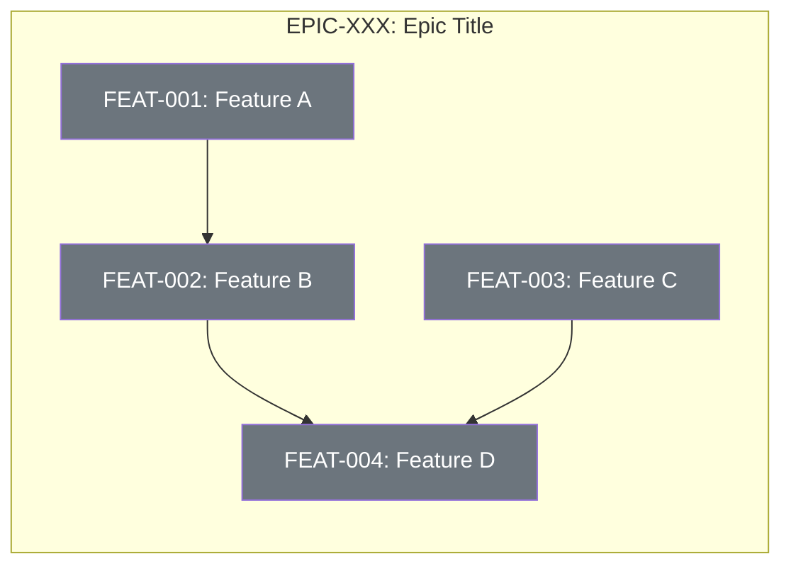
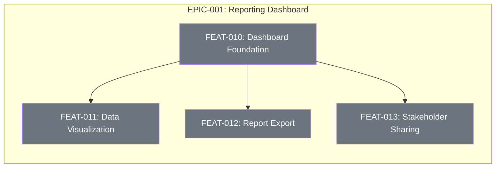

# Epic Feature Template

## What is an Epic?

An **Epic** is a large body of work that represents a significant capability or improvement to the system. It is too large to be completed in a single development cycle and must be decomposed into smaller, manageable **Features**, which are further broken down into **Tasks**.

### Hierarchy

```
EPIC (Strategic Goal)
  └── FEATURE (User-facing capability)
        └── TASK (Implementation step)
```

### Purpose of Epics

1. **Connect work to goals**: Epics link day-to-day tasks to long-term project objectives
2. **Provide visibility**: Stakeholders can track progress at a high level
3. **Manage dependencies**: Features within an epic often have inter-dependencies
4. **Prevent burnout**: Breaking large work into tangible milestones keeps teams motivated
5. **Enable parallel work**: Independent features can be developed concurrently

---

## Epic Document Structure

### 1. Epic Metadata

```markdown
# EPIC-XXX: [Epic Title]

| Field | Value |
|-------|-------|
| Epic ID | EPIC-XXX |
| Status | DRAFT / APPROVED / IN_PROGRESS / COMPLETED |
| Created | YYYY-MM-DD |
| Target Completion | YYYY-QX or YYYY-MM |
| Owner | [Name/Team] |
| Priority | Critical / High / Medium / Low |
```

### 2. Executive Summary

A 2-3 sentence description of the epic that answers:
- What are we building?
- Why are we building it?
- Who benefits from it?

### 3. Problem Statement

Describe the current pain points or gaps that this epic addresses:
- What problem exists today?
- What is the impact of not solving it?
- What opportunities are we missing?

### 4. Success Criteria

Define measurable outcomes that indicate the epic is complete:
- [ ] Criterion 1 (measurable)
- [ ] Criterion 2 (measurable)
- [ ] Criterion 3 (measurable)

### 5. Features Breakdown

List all features that compose this epic. Each feature should be:
- **Independent enough** to be developed and released separately
- **Valuable enough** to provide user benefit on its own
- **Small enough** to be completed in a reasonable timeframe

```markdown
| Feature ID | Title | Status | Dependencies | Priority |
|------------|-------|--------|--------------|----------|
| FEAT-001 | Feature name | NOT_STARTED | None | P1 |
| FEAT-002 | Feature name | NOT_STARTED | FEAT-001 | P1 |
| FEAT-003 | Feature name | NOT_STARTED | None | P2 |
| FEAT-004 | Feature name | NOT_STARTED | FEAT-002, FEAT-003 | P2 |
```

### 6. Dependency Flow Diagram

Visual representation of feature dependencies using Mermaid:



**Legend:**
- 🟢 Green = Completed
- 🟡 Yellow = In Progress
- ⚪ Gray = Not Started
- 🔴 Red = Blocked

### 7. Feature Details

For each feature, provide a brief description:

#### FEAT-001: [Feature Title]
**User Story:** As a [user type], I want [capability] so that [benefit].

**Scope:**
- What's included
- What's excluded

**Dependencies:** None

---

#### FEAT-002: [Feature Title]
**User Story:** As a [user type], I want [capability] so that [benefit].

**Scope:**
- What's included
- What's excluded

**Dependencies:** FEAT-001 (requires X from Feature A)

---

### 8. Out of Scope

Explicitly list what this epic does NOT include to prevent scope creep:
- Item 1
- Item 2
- Item 3

### 9. Risks and Mitigations

| Risk | Impact | Likelihood | Mitigation |
|------|--------|------------|------------|
| Risk description | High/Med/Low | High/Med/Low | How to address |

### 10. Progress Tracking

Update this section as work progresses:

```markdown
| Feature ID | Status | Started | Completed | Notes |
|------------|--------|---------|-----------|-------|
| FEAT-001 | NOT_STARTED | - | - | |
| FEAT-002 | NOT_STARTED | - | - | Blocked by FEAT-001 |
| FEAT-003 | NOT_STARTED | - | - | |
| FEAT-004 | NOT_STARTED | - | - | Blocked by FEAT-002, FEAT-003 |

**Overall Progress:** 0/4 features complete (0%)
```

---

## Example Epic

# EPIC-001: Reporting Dashboard

| Field | Value |
|-------|-------|
| Epic ID | EPIC-001 |
| Status | APPROVED |
| Created | 2026-01-13 |
| Target Completion | 2026-Q2 |
| Owner | Product Team |
| Priority | High |

## Executive Summary

Create a comprehensive reporting dashboard that allows end-users to track their progress within the app, visualize data through interactive graphs, and share reports with stakeholders.

## Problem Statement

Currently, users have no centralized way to view their activity and progress. They must manually compile information from various screens, which is time-consuming and error-prone. This leads to:
- Poor visibility into personal progress
- Difficulty sharing status with stakeholders
- Inability to identify trends over time

## Success Criteria

- [ ] Users can view all key metrics in a single dashboard
- [ ] Reports can be exported in PDF and CSV formats
- [ ] Stakeholders can be invited to view dashboards
- [ ] Dashboard loads in under 2 seconds
- [ ] 80% of beta users rate the dashboard as "useful" or "very useful"

## Features Breakdown

| Feature ID | Title | Status | Dependencies | Priority |
|------------|-------|--------|--------------|----------|
| FEAT-010 | Dashboard Foundation | NOT_STARTED | None | P1 |
| FEAT-011 | Data Visualization | NOT_STARTED | FEAT-010 | P1 |
| FEAT-012 | Report Export | NOT_STARTED | FEAT-010 | P2 |
| FEAT-013 | Stakeholder Sharing | NOT_STARTED | FEAT-010 | P2 |

## Dependency Flow Diagram



## Feature Details

### FEAT-010: Dashboard Foundation
**User Story:** As a user, I want a dashboard for reporting so that I can quickly see my data in one place.

**Scope:**
- Dashboard page layout and navigation
- Core data fetching infrastructure
- Basic metrics display (numbers, percentages)

**Dependencies:** None

---

### FEAT-011: Data Visualization
**User Story:** As a user, I want graphs to showcase my work visually so that I can include them in formal reports and presentations.

**Scope:**
- Line charts for trends over time
- Bar charts for comparisons
- Pie charts for distributions
- Interactive tooltips

**Dependencies:** FEAT-010 (requires dashboard infrastructure)

---

### FEAT-012: Report Export
**User Story:** As a user, I want to download reports so that I can share them with stakeholders who don't have app access.

**Scope:**
- Export to PDF format
- Export to CSV format
- Date range selection for exports

**Dependencies:** FEAT-010 (requires data to export)

---

### FEAT-013: Stakeholder Sharing
**User Story:** As a user, I want to add stakeholders to my dashboard so that everyone has access to project progress.

**Scope:**
- Invite stakeholders by email
- Read-only dashboard view for stakeholders
- Manage stakeholder access (add/remove)

**Dependencies:** FEAT-010 (requires dashboard to share)

## Out of Scope

- Real-time collaborative editing of dashboards
- Custom dashboard themes/branding
- API access to dashboard data
- Mobile-optimized dashboard (future epic)

## Risks and Mitigations

| Risk | Impact | Likelihood | Mitigation |
|------|--------|------------|------------|
| Performance issues with large datasets | High | Medium | Implement pagination and caching early |
| Complex chart library integration | Medium | Medium | Spike on chart library selection first |
| Scope creep from stakeholder requests | High | High | Strictly enforce out-of-scope list |

## Progress Tracking

| Feature ID | Status | Started | Completed | Notes |
|------------|--------|---------|-----------|-------|
| FEAT-010 | NOT_STARTED | - | - | Foundation - must complete first |
| FEAT-011 | NOT_STARTED | - | - | Blocked by FEAT-010 |
| FEAT-012 | NOT_STARTED | - | - | Blocked by FEAT-010 |
| FEAT-013 | NOT_STARTED | - | - | Blocked by FEAT-010 |

**Overall Progress:** 0/4 features complete (0%)

---

## File Organization

Epics should be stored in `MemoryBank/Features/00_EPICS/`:

```
MemoryBank/Features/
├── 00_EPICS/
│   ├── EPIC-001-reporting-dashboard/
│   │   ├── EpicDescription.md
│   │   └── DependencyDiagram.md (optional, if complex)
│   └── EPIC-002-mobile-notifications/
│       └── EpicDescription.md
├── 01_SUBMITTED/
├── 02_READY_TO_DEVELOP/
├── 03_IN_PROGRESS/
└── 04_COMPLETED/
```

Each feature folder (FEAT-XXX) should reference its parent epic in the FeatureDescription.md.
